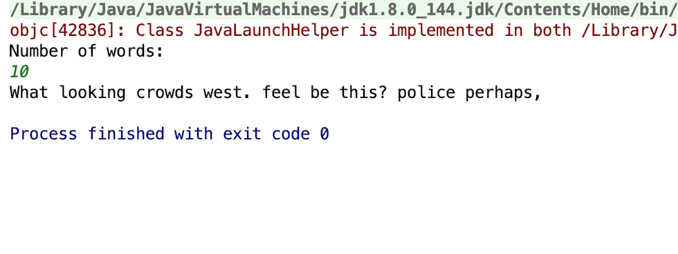

# AI

## file.txt
file.txt should not be in the src. It is just a block of text used to train the AI. You can copy any lengths of text into this doc. 

## MarkovChain.java
This the java code in the src. If you open this file in IntelliJ, you will be able to run the code on the console and it will generate sentences. 

## IntelliJ 
This is a link to how to intstall IntelliJ: https://www.jetbrains.com/idea/
